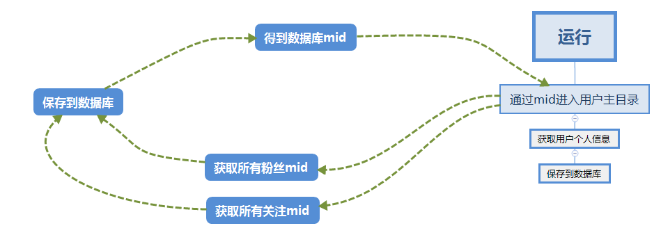
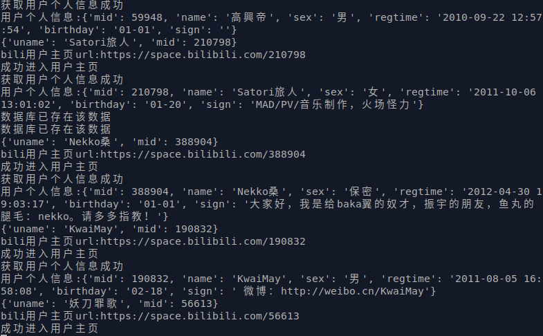

# 教你用Python爬取哔哩哔哩全站用户信息
*每天可能更新十几次,文档下核心代码不准确*
## 运行
### 下载
```
git clone https://github.com/cexll/bili_user_Spider.git
```
### 运行环境
- Ubuntu
- Python 3.6
- VSCode
### 依赖
- requests
- pymysql
- mysql

使用本脚本请先安装好MySQL,并且安装好库
```
pip install -r requirements.txt
```
**运行脚本前请确保数据库创建好数据库和数据表**


**创建数据库**
```
CREATE DATABASE bilibili;
```
**创建数据表,这里需要两个**


**这一个数据表存储用户信息**
```
CREATE TABLE `myinfo` (
    `id` int(18) NOT NULL AUTO_INCREMENT,
    `mid` int(18) NOT NULL,
    `name` varchar(255) COLLATE utf8_bin,
    `sex` varchar(20) COLLATE utf8_bin,
    `regtime` varchar(255) COLLATE utf8_bin,
    `birthday` varchar(255) COLLATE utf8_bin,
    `sign` varchar(255) COLLATE utf8_bin,
    PRIMARY KEY (`id`)
) ENGINE=InnoDB DEFAULT CHARSET=utf8 COLLATE=utf8_bin
AUTO_INCREMENT=1 ;
```
**这一个数据表存储mid**
```
CREATE TABLE `list` (
    `id` int(18) NOT NULL AUTO_INCREMENT,
    `mid` int(18),
    `name` varchar(255) COLLATE utf8_bin,
    PRIMARY KEY (`id`)
) ENGINE=InnoDB DEFAULT CHARSET=utf8 COLLATE=utf8_bin
AUTO_INCREMENT=1 ;
```

打开`config.py`

```
# 用户MID
USERMID = 填写自己bilibili的MID
# 用户Cookie
COOKIE = 填写自己登陆bilibili后的Cookie
# MySQL 连接
MYSQL_DB = '填写MySQL创建的数据库名称'
MYSQL_HOST = '连接地址'
MYSQL_USER = '连接用户'
MYSQL_PASSWORD = '连接密码'
```
### 运行
```
python3 spider.py
```

## 思路
*这是用思维导图画的一个脚本的大致运行情况*

**程序的大致思路是这样,通过mid进入用户主目录,然后获取用户个人信息并保存到数据库,然后获取用户的粉丝数量以及关注数量方便之后计算页数,下一步获取所有的关注用户mid以及粉丝用户mid保存到数据库,然后依次提取数据库mid进入用户主目录循环至结束**

### 运行过程


### 数据来源
数据通过`bilibili`官方`api`获取除了获取`个人信息`必须要进入`用户目录`才能成功获取其他都可直接通过`API`获取到数据

## 分析代码
这里就上最主要的代码

运行函数,首选进入用户主页然后获取个人信息到数据库

然后获取粉丝数量以及关注数量


50 为api最多能获得的数据


通过`关注数量 / 50` 得到页数, 这里做了如果结果`小于或等于1`那么就直接当1,不然`range(1, 1)`是无法运行的


这次使用了多进程
```python
def run(mid):
    """
    运行函数
    """
    try:
        # 进入用户主页
        get_space(mid)

        # 获取关注数量和粉丝数量
        f, g = get_myinfo(mid)

        # 获取关注用户信息
        f_g_ps = 50
        f_g_pn = int(g / f_g_ps)+1
        if f_g_pn <= 1:
            get_followers(mid, 1, f_g_ps)
        else:
            for g_pn in range(1, f_g_pn):
                get_followings(mid, g_pn, f_g_ps)

        # 获取粉丝用户信息
        f_r_ps = 50
        f_r_pn = int(f / f_r_ps)+1
        if f_r_pn <= 1:
            get_followers(mid, 1, f_r_ps)
        else:
            for r_pn in range(1, f_r_pn):
                get_followers(mid, r_pn, f_r_ps)

        # 提取一个mid继续运行
        return run(rep_run())
    except ReadTimeout as e:
        print('达到递归深度', e)
        time.sleep(5)
```

## 核心代码

这里`MIN`必须要先初始值,就设置了一个全局变量,进入`rep_run`,`MIN`变量加一,连接`list`数据库,查询数据库count保存到`count`,判断`MIN`是否大于`count`,如果大于则说明数据库数据已经运行完了,直接结束脚本,如果不大于则继续循环
```python
def rep_run():
    """
    当上一个mid所有事情完成后进入此函数进行循环爬取下一个mid
    """
    global MIN
    try:
        # 每次运行此函数使MIN加一,不能大于max(数据库count)
        MIN += 1
        cursor = db.cursor()
        # 执行SQL得到COUNT
        sql = "SELECT COUNT(id) FROM `list`"
        cursor.execute(sql)
        r = cursor.fetchone()
        if r:
            for i in r:
                ir = i
            # 判断count是否小于MIN,如果小于则停止程序
            if ir < MIN:
                print('程序即将停止运行,所有信息爬取完成')
                time.sleep(10)
                db.close()
                exit()
            else:
                sql = "SELECT `mid` FROM `list` WHERE id=%d" % (MIN)
                cursor.execute(sql)
                r = cursor.fetchone()
                if r:
                    for i in r:
                        return i
    except ReadTimeout as e:
        print('达到递归深度', e)
        time.sleep(5)
```


    
